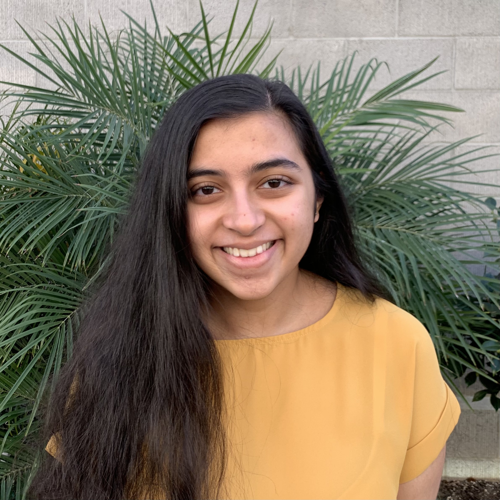
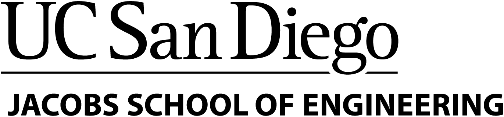

# Anoushka Dave

`System.out.println("Hello, World! Welcome to my personal website!");`

I am a second-year Computer Science student at UC San Diego in Marshall College. I love *programming*, implementing my vision through *personal projects*, and helping my *community*. Outside of classes, I actively participate in *student organizations* and love *theatre*!

**My favorite inspirational _quote_ is**: 
> You never lose, you either win or you learn.

I would love to connect and share my full resume with you! To get to know me better, visit my [LinkedIn](https://www.linkedin.com/in/anoushka-dave/) or [email me](mailto:adave@ucsd.edu)! Check out all of my projects by visiting my [GitHub](https://github.com/anoushkadave)! I look forward to speaking with you 😄!

The following sections describe my experiences in more detail:

[Education](#education)

[Programming Skills](#programming-skills)

[Languages](#languages)

## Education

#### Bachelor of Science, Computer Science
##### Minor in Theatre
***University of California, San Diego***, **GPA: 4.000**

*September 2019 - Anticipated June 2023*

- Provost Honors Recipient (Fall 2019, Winter 2020, Spring 2020, Fall 2020)
- Thurgood Marshall College Honors Student
- Relevant Coursework
   - Programming Courses 
     - [x] Basic Data Structures (CSE 12)
     - [x] Software Tools & Techniques (CSE 15L)
     - [x] Computer Organization & Systems Programming (CSE 30)
     - [x] Advanced Data Structures (CSE 100)
     - [ ] Software Engineering (CSE 110)
     - [ ] Introduction to Machine Learning (CSE 151A)
   - Theory Courses
     - [x] Discrete Mathematics (CSE 20)
     - [x] Mathematics for Algorithms & Systems (CSE 21)
     - [x] Theory of Computation (CSE 105)
   - Mathematics Courses
     - [x] Vector Calculus (MATH 20C)
     - [x] Linear Algebra (MATH 18)
     - [x] A Practical Introduction to Probability & Statistics (CSE 103)
   - General Education
     - [x] ~~DOC Writing Series (DOC 1-3)~~
     - [x] ~~General Chemistry 1 (CHEM 6A)~~

#### High School Diploma
***University Preparatory Academy***, **GPA: 4.000**

*August 2015 - June 2019*

- 9 Advanced Placement Courses

## Programming Skills

#### Proficient
- Java, C, C++, Python, JavaScript, TypeScript
- HTML, CSS
- ReactJS, React Native
- Object-Oriented Programming
- Git, GitHub
- Unix (Bash)
- Agile

#### Familiar
- macOS, Windows, Linux
- Node.js, Express
- Assembly (ARM)
- Swift
- MongoDB
- Socket.io
- JUnit Testing Framework

## Languages

1. English, *Native*
2. Hindi, *Native*
3. Gujarati, *Native*
4. Spanish, *Conversational*

